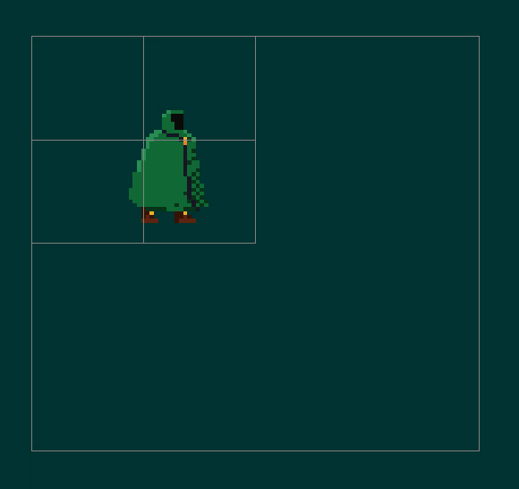
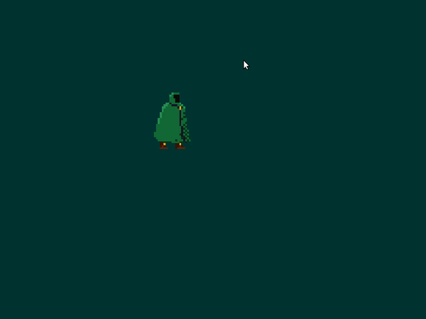

# 🌿🎮 Druid Engine

**Index**
* [About the author](#about-the-author)
* [Evolution of Druid Engine](#evolution-of-druid-engine)
* [YouTube Devlogs](#youtube-devlogs)

---

Hi! This is a **showcase** repository to show the evolution of my custom 2D C++ Game Engine, 🌿🎮 Druid Engine.

> Druid Engine 🌿🎮 is a C++ / OpenGL Game Engine made from scratch with the only purpose of improving my gamedev and programming skills.

---

## About the author

   Hi again! I'm Adrian, passionate about gamedev, working on Druid Engine.
   C++ UE4 programmer during day!

   **Twitter**: [Link to my Twitter profile](https://twitter.com/AdrianensisDev)
   **YouTube**: [Link to my YouTube channel](https://www.youtube.com/c/Adrianensis)
   **Portfolio**: [Link to my Portfolio](https://adrianecom.github.io/portfolio)

---

## Evolution of Druid Engine

|   |   |   |
|---|---|---|
||||
||||
|||**+80 gifs [here!](Evolution.md) 🌿🎮**|

## YouTube Devlogs

<!--  -->

I created a short Devlog series in YouTube to explain in general aspects the most important modules I implemented in Druid Engine.

|Links to my YouTube channel and the Devlog playlist|
|---|
|[ Link to my YouTube channel](https://www.youtube.com/c/Adrianensis)|
|[ Link to Druid Engine - Devlog Playlist](https://www.youtube.com/watch?v=ViNNHauNDpw&list=PLfQ-ZA-2VtX2gE5ZX4U3I63zGHeWsxyxk)|

#### Druid Engine - Devlog Playlist

Here all the single videos in the playlist in case you want to take a quick look.
**Click any image** to go to the video!

|   |   |   |
|---|---|---|
||||
||||

---
